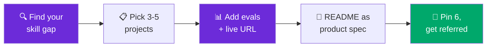

# AI Engineer Portfolio Projects

**80+ buildable AI engineering portfolio projects for 2026** — grouped by theme, each with difficulty, the skills it proves, and annotated reference resources.

*Maintained by [Landed](https://landed.jobs) — daily AI-native job matches, agent help with every application, and mock-interview prep.*

---

This is the **broad, browsable catalog** — 80+ genuinely distinct, buildable AI engineering projects across 10 themes, each tagged with a difficulty, the exact skills it proves, and 1–3 typed, license-noted reference resources. **Pick by your skill gap, not by vibe:** find the theme where your portfolio is thinnest, ship 3–5 projects with real evals and a live URL, and write each README as a product spec. **One production project with proper evals beats five tutorial clones** — hiring managers scan for observability, error handling, eval rigor, and a live link in about 90 seconds.

> ⭐ **Star this repo** — it's the exhaustive companion to the curated shortlist, refreshed for 2026.

> [!NOTE]
> **Want just the top 12 that actually land jobs?** This catalog is breadth. For the curated, opinionated shortlist of the highest-signal builds — the ones hiring managers scan for — see the sibling repo **[projects-to-land-an-ai-job →](https://github.com/landedjobs/projects-to-land-an-ai-job)**.

## 📚 Contents

| Theme | Projects | What it proves | Catalog |
|-------|:--------:|----------------|---------|
| 🔎 **RAG apps** | 12 | Retrieval, chunking, re-ranking, grounded citations | [catalog/rag-apps.md](catalog/rag-apps.md) |
| 🤖 **Agents & tool-use** | 12 | Orchestration, tools, memory, guardrails | [catalog/agents.md](catalog/agents.md) |
| 📊 **Evals & LLMOps** | 10 | Golden sets, LLM-as-judge, CI gates, tracing | [catalog/evals-llmops.md](catalog/evals-llmops.md) |
| 🎛️ **Fine-tuning & training** | 8 | LoRA/QLoRA, DPO, distillation, eval-vs-base | [catalog/fine-tuning.md](catalog/fine-tuning.md) |
| 🎨 **Multimodal** | 8 | STT/TTS, VLMs, real-time streaming | [catalog/multimodal.md](catalog/multimodal.md) |
| 🧩 **Structured extraction** | 7 | Pydantic/Zod, validation, confidence, retry | [catalog/structured-extraction.md](catalog/structured-extraction.md) |
| 🔬 **LLM from-scratch & internals** | 7 | Tokenizers, transformers, training loops, CUDA | [catalog/llm-from-scratch.md](catalog/llm-from-scratch.md) |
| ⚙️ **Production & serving** | 8 | vLLM/llama.cpp, quantization, latency, cost | [catalog/production-serving.md](catalog/production-serving.md) |
| 🧠 **Prompt & DSPy** | 6 | Metric-driven prompt optimization, context eng. | [catalog/prompt-dspy.md](catalog/prompt-dspy.md) |
| 🚀 **GTM & AI-PM prototypes** | 7 | GTM automation, prototyping, AI-PM builds | [catalog/gtm-ai-pm.md](catalog/gtm-ai-pm.md) |

**Total: 85 projects.** Also below: [what wins in 2026](#-what-wins-a-90-second-scan) · [best build-with-me hubs](#-best-build-with-me-hubs-to-learn-from) · [what's new](#-whats-new-2026-07) · [FAQ](#-faq).

**Difficulty legend:** 🟢 Beginner · 🟡 Intermediate · 🔴 Advanced
**Link types:** 📄 paper · 📘 docs · 🎬 video · 🧑‍🏫 course · 🛠️ tool · 💻 repo

---

## 🏆 What wins: a 90-second scan

Hiring managers don't clone your repo — they scan it. This is what they look for, in order:

| Signal | Why it wins | Where to add it |
|--------|-------------|-----------------|
| **Production RAG** (hybrid + reranking + citations) | Most-cited must-have skill | [RAG apps](catalog/rag-apps.md) |
| **Eval suite** (faithfulness, precision, hallucination rate) | "Eval is the new system design" | [Evals & LLMOps](catalog/evals-llmops.md) |
| **Live deployment URL** (Vercel / Modal / Railway) | Reviewers won't clone — they click | [Production & serving](catalog/production-serving.md) |
| **README as product spec** (problem, arch diagram, eval numbers, cost) | Reads as a shipped product | every project |
| **Observability + cost tracking** (Langfuse / Phoenix) | Signals production maturity | [Evals & LLMOps](catalog/evals-llmops.md) |
| **Error handling** (retry, backoff, cost caps) | Signals reliability | [Agents](catalog/agents.md) |
| **Quantitative results** (X% lift, $Y/1k tokens, p50/p95) | Numbers beat claims | every project |
| **Open-source PR / issue history** | Real collaboration, not a tutorial clone | any framework above |

> [!WARNING]
> **Red flags that sink a portfolio:** "GPT-4 wrapper, no original work" · "no eval, just vibes" · "benchmark claims without numbers" · "five copy-pasted Streamlit demos." Depth on **4–6 evaluated projects** beats a long list of clones.

**Per-project polish checklist:** problem statement · architecture diagram · clean-clone setup (Dockerfile) · demo (live URL or 90-second GIF) · eval table (3+ metrics) · cost analysis ($/1k tokens, p50/p95) · failure modes · pinned repo (max 6) · a short design-tradeoffs write-up.

---

## 🗂️ The catalog

Each theme file lists the full project set with a one-line "what you build," the skills it proves, a difficulty rating, and annotated + license-noted references.

### 🔎 RAG apps → [full list (12)](catalog/rag-apps.md)
The highest-signal theme. Ship at least one **hybrid-retrieval RAG with an eval table and citations.**

| Project | What you build | Skills | Difficulty |
|---------|----------------|--------|:----------:|
| Document Q&A RAG | Hybrid PDF/Slack/Notion Q&A with citations | chunking, BM25+dense, citations | 🟢 |
| Contextual-chunk RAG | Anthropic contextual retrieval, measured lift | contextual chunking, recall@k | 🟡 |
| Agentic RAG | Retrieve-decide-retrieve loop | routing, iterative retrieval | 🔴 |
| GraphRAG | Entity graph + community summaries | graph extraction, summarization | 🔴 |
| Corrective RAG | Relevance grading + hallucination checker | grading, verification, guardrails | 🟡 |
| Multi-modal RAG (ColPali) | Retrieve over page images, not OCR | visual retrieval, VLM answering | 🔴 |
| Re-ranking pipeline | Cross-encoder rerank + nDCG/MRR lift | two-stage retrieval, ranking | 🟡 |
| Hybrid search from scratch | BM25 + dense + RRF fusion | lexical/semantic fusion | 🟡 |

*…and 4 more (query-rewriting, text-to-SQL, long-context benchmark, NotebookLM clone).*

### 🤖 Agents & tool-use → [full list (12)](catalog/agents.md)
Add **retry, backoff, cost caps, and tracing** and one agent outshines ten toy loops.

| Project | What you build | Skills | Difficulty |
|---------|----------------|--------|:----------:|
| Multi-agent research team | LangGraph supervisor → cited report | routing, shared state | 🟡 |
| ReAct agent (5+ tools) | Reasoning loop over real tools | tool schemas, recovery | 🟡 |
| MCP coding agent | Reads issues, edits code, opens PRs via MCP | MCP, sandboxed exec | 🔴 |
| Persistent-memory agent | MemGPT-style long-term memory | memory hierarchy, retrieval | 🔴 |
| Voice support agent | STT → tools → TTS with barge-in | streaming, latency budgets | 🔴 |
| Browser / computer-use agent | Drives a real browser to finish tasks | vision-grounded action | 🔴 |

*…and 6 more (CrewAI trip planner, hierarchical supervisor, plan-execute, game agent, briefing agent, Reflexion self-improver).*

### 📊 Evals & LLMOps → [full list (10)](catalog/evals-llmops.md)
The most under-built theme relative to how much it's asked about. **"Eval is the new system design."**

| Project | What you build | Skills | Difficulty |
|---------|----------------|--------|:----------:|
| RAGAS eval harness | Faithfulness/precision/relevance on a golden set | golden sets, RAG metrics | 🟡 |
| LLM-as-judge + spot-check | Rubric judge validated against humans | rubric design, agreement | 🟡 |
| CI eval gate | Fail a PR on quality regression | CI/CD, thresholds | 🟡 |
| Trace cost/latency dashboard | p50/p95, tokens, $/1k per route | tracing, cost accounting | 🟡 |
| Red-team eval suite | Jailbreak/injection attack-success rate | red-teaming, safety | 🔴 |
| Drift monitor | Online quality + input drift alerts | monitoring, drift detection | 🔴 |

*…and 4 more (A/B significance, hallucination audit, golden-set builder, model leaderboard).*

### 🎛️ Fine-tuning & training → [full list (8)](catalog/fine-tuning.md)
Only counts if you **eval the tuned model against the base** and report the delta.

| Project | What you build | Skills | Difficulty |
|---------|----------------|--------|:----------:|
| LoRA fine-tune vs base | Tune small Llama, head-to-head eval | LoRA, base-vs-tuned eval | 🟡 |
| QLoRA on consumer GPU | 4-bit tuning that fits 16GB | quantization, memory budgeting | 🟡 |
| DPO preference tuning | Align on preferred/rejected pairs | DPO, win-rate eval | 🔴 |
| Embedding fine-tune for RAG | Boost recall@k on your corpus | contrastive training | 🟡 |
| Reasoning distillation | Distill CoT into a small student | distillation, reasoning eval | 🔴 |
| GRPO on verifiable rewards | RL tune with checkable rewards | RL fine-tuning, reward design | 🔴 |

*…and 2 more (Axolotl/Llama-Factory SFT, synthetic-data generation + filtering).*

### 🎨 Multimodal → [full list (8)](catalog/multimodal.md)
Demos incredibly well live. One polished voice or vision app is a memorable artifact.

| Project | What you build | Skills | Difficulty |
|---------|----------------|--------|:----------:|
| Whisper + diarization | Transcribe + label speakers | ASR, diarization | 🟡 |
| Blog-to-podcast agent | Article → two-host audio episode | summarization, multi-voice TTS | 🟡 |
| CLIP image search | Search an image library by text | joint embeddings, vector search | 🟢 |
| Chart/receipt digitizer | Vision → validated JSON | vision extraction, schema | 🟡 |
| Real-time voice bot | WebRTC + STT + agent + TTS, sub-second | real-time media, turn-taking | 🔴 |

*…and 3 more (LLaVA visual chat, MiniGPT-4 captioning/VQA, text-to-image + eval).*

### 🧩 Structured extraction → [full list (7)](catalog/structured-extraction.md)
Quietly the most employable skill — every enterprise AI feature depends on it.

| Project | What you build | Skills | Difficulty |
|---------|----------------|--------|:----------:|
| Resume parser | Strict schema + per-field confidence | Pydantic, validation, retry | 🟢 |
| Invoice extractor + HITL | Extract + route low-confidence to review | nested schemas, review UX | 🟡 |
| Text → KG triples → Neo4j | Extract triples, load a graph DB | relation extraction, Cypher | 🔴 |
| Schema-locked agent output | Force every agent reply into a schema | constrained decoding | 🟡 |

*…and 3 more (entity disambiguation, calibrated classification, web-page → records).*

### 🔬 LLM from-scratch & internals → [full list (7)](catalog/llm-from-scratch.md)
Doesn't ship a product — buys **interview credibility.** Pair each with a short write-up.

| Project | What you build | Skills | Difficulty |
|---------|----------------|--------|:----------:|
| BPE tokenizer | Train merges, encode/decode | BPE, vocab construction | 🟢 |
| nanoGPT (124M) | Reproduce GPT-2-scale training | training loops, LR schedules | 🟡 |
| llm.c (C/CUDA) | GPT-2 at the metal | CUDA kernels, low-level autograd | 🔴 |
| Tiny Llama | RoPE, RMSNorm, SwiGLU, GQA | modern-LLM building blocks | 🔴 |
| KV-cache + spec decoding | Measure tokens/sec speedup | inference optimization | 🔴 |

*…and 2 more (Raschka full LLM build, attention visualizer).*

### ⚙️ Production & serving → [full list (8)](catalog/production-serving.md)
Where "I built a demo" becomes "I can run this in production." Put the numbers in the README.

| Project | What you build | Skills | Difficulty |
|---------|----------------|--------|:----------:|
| vLLM OpenAI-compatible API | Self-host + benchmark throughput | paged-attention, batching | 🟡 |
| llama.cpp edge deploy | Quantized GGUF anywhere | GGUF quantization, tokens/sec | 🟡 |
| FastAPI + SSE streaming | Production-shaped chat backend | streaming, auth, rate limits | 🟡 |
| One-click deploy (Modal) | Give any project a live URL | serverless GPU, secrets | 🟡 |
| vLLM stack on K8s | Routing, autoscaling, observability | K8s, GPU scheduling | 🔴 |
| Semantic-cache gateway | Cache + budget caps + fallbacks | gateway routing, cost control | 🟡 |

*…and 2 more (MLX on Apple Silicon, batch inference pipeline).*

### 🧠 Prompt & DSPy → [full list (6)](catalog/prompt-dspy.md)
Stop hand-tuning strings; **program and optimize** prompts against a metric.

| Project | What you build | Skills | Difficulty |
|---------|----------------|--------|:----------:|
| DSPy optimized pipeline | Compile prompts against a metric | DSPy modules, optimization | 🟡 |
| Prompt optimizer vs baseline | Beat your best manual prompt | automated search, held-out eval | 🟡 |
| Context-engineering study | What to put in the window, measured | context selection, compression | 🟡 |
| Prompt-injection playground | Attacks + layered defenses, measured | injection, defense-in-depth | 🟡 |

*…and 2 more (prompt versioning + registry, CoT vs self-consistency benchmark).*

### 🚀 GTM & AI-PM prototypes → [full list (7)](catalog/gtm-ai-pm.md)
The most under-built theme relative to demand. Build one and you're differentiated by default.

| Project | What you build | Skills | Difficulty |
|---------|----------------|--------|:----------:|
| Context-aware sales agent | Multi-channel agent with memory | conversational memory, GTM | 🟡 |
| Lead-scoring + enrichment | Enrich + score against an ICP | enrichment, ICP scoring | 🟡 |
| Brief → landing page | One-line brief → deployable page | structured + image + code gen | 🟡 |
| Brief → prototype (AI-PM) | Feature brief → clickable prototype | spec parsing, code gen | 🔴 |
| Meeting-notes → CRM agent | Call → action items → CRM writes | transcription, extraction | 🟡 |

*…and 2 more (support-ticket classifier, competitor/pricing monitor).*

---

## 🧰 Best build-with-me hubs to learn from

Don't start from a blank file — these hubs have runnable references for almost every project above. **License matters if you plan to redistribute:** ship your own work MIT, and only adapt MIT/Apache/CC0 code (with attribution).

| Hub | Stars | License | Best for |
|-----|:-----:|---------|----------|
| 💻 [Shubhamsaboo/awesome-llm-apps](https://github.com/Shubhamsaboo/awesome-llm-apps) | 116k | Apache-2.0 | 100+ ready-to-run agent + RAG apps — the widest starter set |
| 💻 [rasbt/LLMs-from-scratch](https://github.com/rasbt/LLMs-from-scratch) | 97.6k | Apache-2.0 (code) | Build a GPT from scratch: pretraining → fine-tuning, chapter by chapter |
| 💻 [patchy631/ai-engineering-hub](https://github.com/patchy631/ai-engineering-hub) | 36.2k | MIT | In-depth tutorials across RAG, agents, evals, MCP, and serving |
| 💻 [ashishpatel26/500-AI-Agents-Projects](https://github.com/ashishpatel26/500-AI-Agents-Projects) | 33.2k | MIT | 500+ agent use cases with links to open-source implementations |
| 💻 [NirDiamant/RAG_Techniques](https://github.com/NirDiamant/RAG_Techniques) | 28.2k | ⚠️ Non-commercial (custom) | The best RAG-technique notebooks — **re-implement, don't redistribute** |
| 💻 [alexeygrigorev/ai-engineering-field-guide](https://github.com/alexeygrigorev/ai-engineering-field-guide) | 4.2k | check repo | Hiring research: take-homes, assignments, what interviewers actually ask |

> [!WARNING]
> **License caution:** only `RAG_Techniques` here is non-commercial — study and re-implement its techniques in your own code rather than copying notebooks into a repo you publish. Everything else is MIT/Apache-2.0 and safe to fork with attribution.

---

## 🆕 What's new (2026-07)

- **Launched** — 85 projects across 10 themes, each with difficulty, proven-skills, and annotated references. Sibling to the curated [projects-to-land-an-ai-job](https://github.com/landedjobs/projects-to-land-an-ai-job).
- **New in 2026:** MCP-powered coding agents, computer-use/browser agents, GRPO/RL fine-tuning on verifiable rewards, reasoning-model distillation (R1-style), and ColPali-style visual document RAG.
- **"Eval is the new system design"** — expanded the Evals & LLMOps theme (CI gates, drift monitors, red-team suites) because it's the most under-built vs. how much interviewers ask.
- **Context engineering** added to the Prompt & DSPy theme — the 2026 replacement for string-fiddling.

---

## ❓ FAQ

**How many portfolio projects do I need to get an AI engineering job?**
Fewer than you think — **quality over quantity.** Ship **3–5 deeply-evaluated projects**, each with a live URL and an eval table, and **pin 6 max** on your GitHub. One production RAG project with proper evals beats five tutorial clones. Hiring managers scan for depth (observability, error handling, real numbers), not count.

**What are good beginner AI project ideas?**
Start 🟢: a [document Q&A RAG](catalog/rag-apps.md) with citations, a [resume parser](catalog/structured-extraction.md) with confidence scores, a [BPE tokenizer from scratch](catalog/llm-from-scratch.md), a [CLIP image search](catalog/multimodal.md), or a [support-ticket classifier](catalog/gtm-ai-pm.md). Each is a weekend build that proves one clear skill — then add an eval table to level it up.

**What are the best AI agent project ideas for 2026?**
The differentiated ones: a [multi-agent research team](catalog/agents.md) (LangGraph supervisor), an [MCP-powered coding agent](catalog/agents.md), a [persistent-memory agent](catalog/agents.md), or a [computer-use/browser agent](catalog/agents.md). What makes them stand out isn't the framework — it's **retry/backoff, cost caps, guardrails, and tracing.** Add those and you're past 90% of portfolios.

**How do I make a project stand out?**
Four things: (1) a **live URL** — reviewers click, they don't clone; (2) an **eval table** with 3+ metrics and real numbers; (3) a **README written as a product spec** (problem → architecture diagram → eval numbers → cost); (4) **cost/latency figures** ($/1k tokens, p50/p95). Bonus: an open-source PR to a framework you used. See the [90-second scan](#-what-wins-a-90-second-scan).

**Should I build breadth or depth?**
Depth. Use this catalog to find the *theme* where your portfolio is weakest, then go deep on 3–5 projects there. For the curated shortlist of the highest-signal builds, see [projects-to-land-an-ai-job](https://github.com/landedjobs/projects-to-land-an-ai-job).

---

## 🤝 Contributing

PRs and issues welcome — add a project, fix a broken link, or update a star count. Every project must be **buildable**, and every entry must include **skills + difficulty + at least one annotated reference**. See [CONTRIBUTING.md](CONTRIBUTING.md).

---

### Part of the Landed AI-native jobs family

[🌐 **awesome-ai-native-jobs** (umbrella)](https://github.com/landedjobs/awesome-ai-native-jobs) · [🧪 projects-to-land-an-ai-job](https://github.com/landedjobs/projects-to-land-an-ai-job) · [🧠 awesome-ai-engineer-interview](https://github.com/landedjobs/awesome-ai-engineer-interview) · [🗺️ ai-product-engineer-roadmap](https://github.com/landedjobs/ai-product-engineer-roadmap) · [🤖 ai-engineer-jobs](https://github.com/landedjobs/ai-engineer-jobs)

---

### Stop spraying. Get **matched**, get **prepped**, get **Landed**.

Maintained by [Landed](https://landed.jobs) · No affiliation with the companies or projects named. Content MIT-licensed; referenced repos retain their own licenses.

